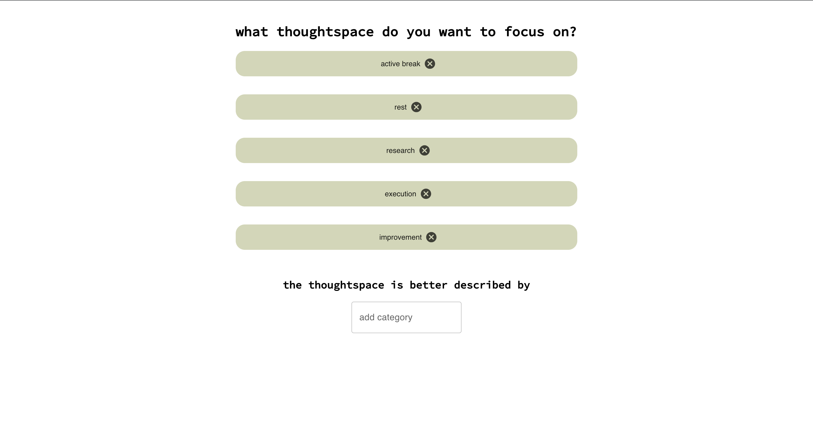

# Welcome to ticktrack

> 'ticktrack' is a responsive web-app that integrates a promodoro-timer. Users can log and save the categories they've worked on. Future implementations will showcase this data in the form of a time-tracker.





## Getting started

###  Prerequisittes

Before running this project, ensure you have installed the following software on your machine: 

- [nodejs](https://nodejs.org/en)
- [postgreSQL](https://www.postgresql.org)
### Install

Run the command to install node packages based on your local environment (e.g. 'npm install') in /client and /server.

```sh
cd ./server
npm install
npm start
```

When successfully connected to the server, the message 'i am listening to 3001' will be displayed in your terminal.

```sh
cd ./client
npm install
npm start
```

When successfully connected to the client, localhost:3000 will be opened in your browser.
## Techstack

- Koa
- Sequelize
- PostgreSQL
- React
- CSS
- MUI

### Project Status

The work on this project slowed down but is soon to be picked up again.

## Author

* Github: [@miriamCodes](https://github.com/miriamCodes)

